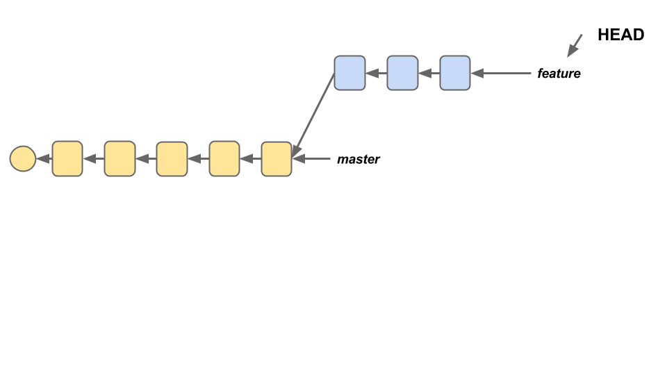
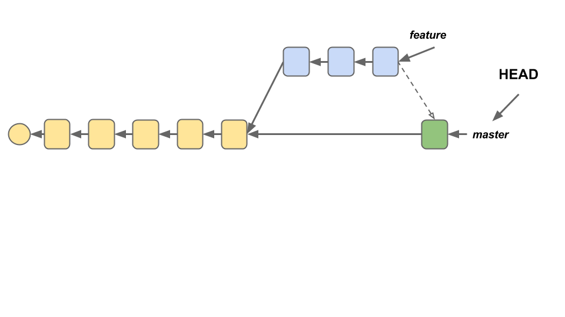
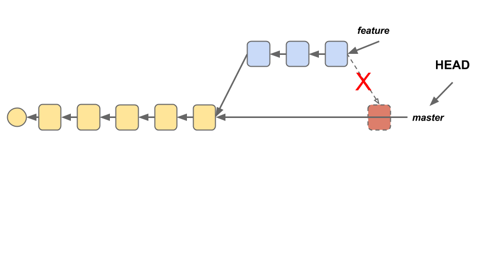
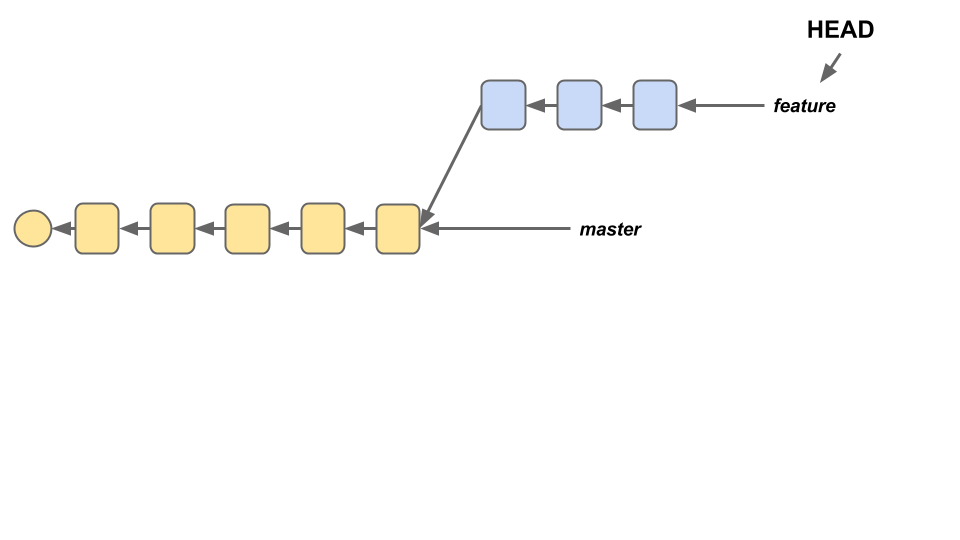
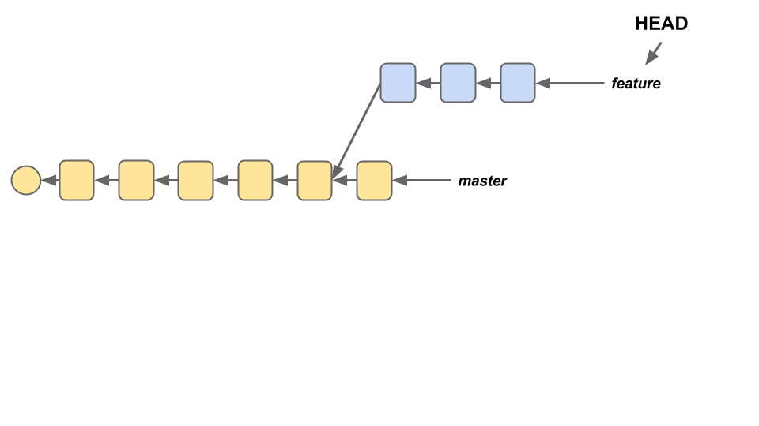
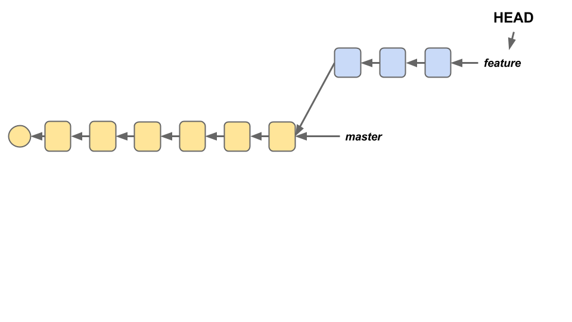

## Objectives
- Create branches on a Git repository and make commits on those branches.
- Combine changes from one branch with another using `git merge`.
- Combine changes from one branch with another using `git rebase`.

## Prerequisites
- Basic Git workflow
- Pre-reading:
  1. https://www.atlassian.com/git/tutorials/using-branches
  2. https://www.atlassian.com/git/tutorials/comparing-workflows
  3. https://www.atlassian.com/git/tutorials/merging-vs-rebasing ('Conceptual Overiew' section)

## REVIEW :: Basic Git Workflow

Although you've all been using Git and Github for over a month, it's still worthwhile to review some of the core ideas of Git.

#### Q: Why Use Version Control?
When you're working on a project, you sometimes want to be able to retrace your steps, or even revert your project to a previous state.  And often (particularly in the workplace) you need a way to effectively collaborate on a single project without stepping on each others' toes. Version control tools address all of these needs.

#### Q: Why Git?
Git, apart from being free and open source, is also in many ways a superior system to many older version control tools (such as Subversion) because it is a "distributed" version control tool. This means that there is no centralized approval structure for making changes to the project; instead, every person who clones the repository has their own complete copy, which they can then edit and change. This makes it much easier to use when working in groups. (In addition, Git is also much better at handling branching and merging than most of its competitors.)

#### Q: How Does Git Work?
Git works by creating ['snapshots'](https://git-scm.com/book/en/v1/Getting-Started-Git-Basics), which record the current state of a repo. Each snapshot represents the state of the project at some moment in time.

To create a new snapshot, we use `git add` to select (or "stage") a file or files that have changed since our last snapshot, and `git commit` to actually create a new snapshot which includes those changes.

## Structure of a Git Repo

A Git repository can be imagined as a tree of interconnected nodes, each representing a commit/snapshot. Each of these nodes refers back to one (usually) previous node, which represents the state of the repository before that commit was made.


Each commit also has a unique name (which allows us to identify it) and a commit message (which tells us what changes the commit makes). `master`, above, is a __branch__ : a reference pointing to some commit in the 'tree' of our repository. New commits can only be made at the end of a branch.


## Branching


In the diagram above, alongside `master` there's another reference called `HEAD`. `HEAD` indicates the point on the repository from which we're reading _and_ to where we're writing. Think of it as the 'point of our pencil'. When we run `git branch`, new branches get added at wherever `HEAD` points. For instance, if we were to run `git branch structure` on the repo above, here's what would happen.


In addition to specifying where new branches go, if HEAD is pointing at the end of a branch, it also means that new commits will be added to that branch. If we want to start adding commits to our new `structure` branch instead of our `master` branch, we have to move `HEAD`; this is done using the command `git checkout`. In particular, we want to checkout the `structure` branch, so we would run `git checkout structure`.


New commits would then be placed onto the `structure` branch.


### Your Turn :: Branching

In the next few exercises, you will each build a simple front-end app. Though you'll be working individually, feel free to turn to your teammates for help.

Create a new repo, and, making commits as appropriate, do the following in the master branch of your repo:
  - Create a boilerplate HTML file (`index.html`), a blank CSS file (`styles/main.css`), and a blank JS file (`js/main.js`).
  - Link all three of these files together.
  - Make a blank README.md file.

Once that's done, make three new branches - `development`, `html-css` and `ajax`.

1. Check out the `html-css` branch. Add a `<div>` element with a `<ul>` inside it to the `<body>` of your HTML document, and give these elements some styling; then, make a commit.
2. Check out the `ajax` branch and add jQuery to your HTML page via a link to the CDN. Then, write the following AJAX request into your `main.js` file, and make another commit.

```javascript
  $(document).ready(function(){
    var sa = 'http://jsonplaceholder.typicode.com';
    $.ajax({
      url: sa + '/posts',
      method: 'GET'
    }).done(function(data) {
      console.log(data);
    });
  });
```

When everyone in your group is finished, tip your laptop screens down.

## Merging

Once you've created all your different branches, you need a way to bring them all back together again. One way that Git allows us to do this is by __merging__ branches.



Merging creates a **new commit on your current branch** (on top of existing commits) that includes all of the changes made by another branch. The syntax for doing this is `git merge some_branch`, where `some_branch` is the branch that you're pulling into your current branch.



This doesn't destroy your original branch; all those commits are still there. However, they're not carried over to the current branch, only their data is.

What if someone got overzealous and made a change to `master` before we merged in `feature`? Well, if the change doesn't conflict with anything in `feature`, probably nothing! Git tries very hard to merge automatically. However, sometimes there are conflicts that Git can't resolve on its own.



In those cases, instead of directly merging, Git asks the user to manually resolve the conflicts. That usually looks something like this:

```javascript
<<<<<<< HEAD
var x = 1,
    y = 2;
=======
var x;
>>>>>>> branch_contributing_to_the_merge
```

The first section is the version that exists on the branch where the merge commit will be made; the second section is the version that exists on the branch you're trying to pull from to create the merge commit. Figure out which one is right, delete all the extra stuff that Git adds (`<<<<<<<`, `=======`, etc.) and run `git commit` to finalize the merge.

### Your Turn :: Merging

Now that you've created some branches in your project, try merging them.

1. Check out the `html-css` branch.
  - Add a button to your page with the id "magic-button".
  - Make some further changes to the style - for instance, changing the background color fo the body to green.
  - Merge the `html-css` branch into `development`.
2. Check out the `ajax` branch.
  - Swap out the `console.log` code in the `done` handler for some code that will (a) clear out the contents of the `<ul>` on our page, and (b) for each object in the response, append a new `<li>` element that contains the object's title.
  - Rename `main.js` to `app.js` using a `git mv`, a special git command for renaming/moving files within a repo, and update the HTML file to match.
  - Merge the `ajax` branch into `development`. Do you hit any merge conflicts? If so, resolve them and make a new commit to finalize the merge.
  - On the `development` branch, go to `app.js` and put the AJAX GET request inside a click handler for the button.

When everyone in your group is finished, tip your laptop screens down.

## Rebasing

While merging represents one path for combining different branches, there is another common path called `rebase`. Rebasing works differently than merging. Rather than combining the finished data from two different branches via a single commit, it combines the two branches _themselves_, rearranging them and, effectively, re-writing history.

Here's what a rebase looks like. Suppose we have two branches, like this.



One day, someone makes a commit onto the `master` branch. We want to include those changes into our feature branch, so that our code doesn't conflict with theirs.



From our feature branch, if we run the command `git rebase master`, we can tell git to rewrite the history of our feature branch as if the new commit on `master` had __always been there__.



Rebase is extremely useful for cleaning up your commit history, but it also carries risk; when you rebase, you are in fact discarding your old commits and replacing them with new (though admittedly, similar) commits, and this can seriously screw up a collaborator if you're working in a shared repo. The golden rule for `git rebase` is "Only rebase **before** sharing your code, **never** after."

Like `git merge`, `git rebase` also sometimes runs into merge conflicts that need to be resolved. The procedure for doing this is almost the same; once you fix the conflicts, run `git rebase --continue` to complete the rebase.

### Your Turn :: Rebasing

Go back to your project and check out the 'master' branch. On that branch...
  - Create a `.gitignore` file with the following contents:
  ```bash
  npm-debug.log
  node_modules/*
  !node_modules/jquery
  ```
  - Run `npm init` to create a `package.json` file, and choose all of the default settings.
  - Run `npm install jquery --save` to download the Node version of the jQuery library.
  - In your `index.html` file, add a script tag to the bottom of the <body> which links to Node's jQuery module.

Next, go through `html-css`, `ajax`, and `development`, and rebase each branch on top of `master`. If you run into conflicts, do your best to resolve them.

Then, check out your `ajax` branch; delete the script tag linking to jQuery's CDN, make a commit, and merge the changed `ajax` branch into `development`.

Finally, open up your browser. Does the page still work correctly?

When everyone in your group is finished, tip your laptop screens down.

## Team Workflows

So far, we've only talked about Merge and Rebase in the context of working alone. In the field, there are many different kinds of team workflows that you might find:

### Single-Remote Workflows
All of the following approaches require that collaborators constantly stay on top of changes to a single shared repository. This is usually accomplished by running `git fetch`, which pulls updates from origin, and merging those updates; alternatively, you could use `git pull` to do both at once.

#### Centralized Workflow
**How It Works**: The remote repo has one single branch on it, `master`. All collaborators have separate clones of this repo. They can each work independently on separate things. However, before they push, they need to run `git fetch`/`git pull` (with the `--rebase` flag) to make sure that their master branch isn't out of date.

(+) Very simple

(-) Collaboration is kind of clunky.

#### Feature Branch Workflow
**How It Works**: This workflow is very similar to the 'Centralized' workflow. The biggest difference is that there are branches (which helps to keep feature-related commits isolated), and that instead of pushing changes up directly, collaborators (a) push up changes to a new remote branch rather than master, and (b) submit a pull request to ask for them to be added to the remote repo's `master` branch.

(+) Better isolation than Centralized model, but sharing is still easy. Very flexible.

(-) Sometimes it's too flexible - it doesn't distinguish in any meaningful way between different branches, and that lack of structure can be problematic for larger projects.

#### 'Gitflow' Workflow
**How It Works**: Similar to the Feature Branch workflows, but with more rigidly-defined branches. For example:
- Historical Branches : `master` stores official releases (see below), while `development` serves as a living 'integration branch' that ties together all the standalone features.
- Release Branches : 'release' branches might spring off of `master`, pointing to the finished project as it existed at a particular moment in time.
- Feature Branches : pretty much the same as in the prior model.
- Maintenance/'Hotfix' Branches : branches used to quickly patch issues with production code.

(+) Highly structured - works well for large projects.

(-) Sometimes overkill for something small.

### Distributed Workflows
These approaches all use multiple remote repos; typically, everyone has their own fork of the 'original' project (the version of the repo that's publicly visible and is managed by the project maintainer), and changes are submitted via pull request.

#### Integration Manager Workflow
**How It Works**: One collaborator plays the role of 'Integration Manager'. This means that they are responsible for managing the official repository and either accepting or rejecting pull requests as they come in.

(+) One person integrates all changes, so there's consistency.

(-) Could get overwhelming for large projects.

#### Dictator/Lieutenants Workflow
**How It Works**: This workflow is very similar to the Integration Manager Workflow. The biggest difference is that rather than submitting all pull requests to a single integration manager, PRs are funneled through 'Lieutentants', who all report to the 'Dictator'. Only the Dictator has write access to the official repo.

(This workflow basically has the opposite tradeoff of the previous one).

### Your Turn :: Team Workflow

Though there are a lot of different potential Git workflows for teams, for your third project, we'd like you to take the following approach:

- Single remote repo, managed by one member of your team.
- Feature branching, with all branches merged into a `development` branch; when this development branch is functional, it gets merged into `master`. No commits are made directly to `master`, only merges from `development` is (largely) clean, apart from merges. For the back-end repo, `master` will used for deployment to Heroku; for the front-end repo, you'll be using the `gh-pages` branch for deployment, so merge `master` into `gh-pages` when you're ready to deploy.
- _No rebasing published code._

To practice this workflow, your team will now use it to create a simple front-end app that (in response to a button-click) uses AJAX to retrieve data from [this API](http://jsonplaceholder.typicode.com/users) and renders the data nicely using Handlebars. Much like the actual front-end repo you make, this repo will need a `gh-pages` branch for deployment.

Make commits regularly, in case you need to undo a mistake!

## Further Reading
- http://git-scm.com/book/en/v2/Git-Branching-Branches-in-a-Nutshell
- http://git-scm.com/book/en/v2/Distributed-Git-Distributed-Workflows
