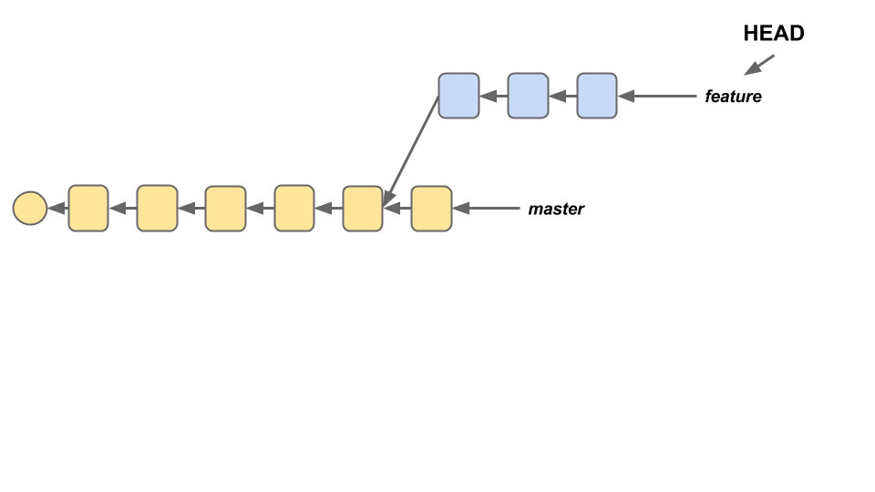
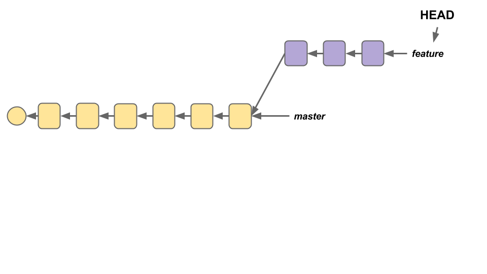
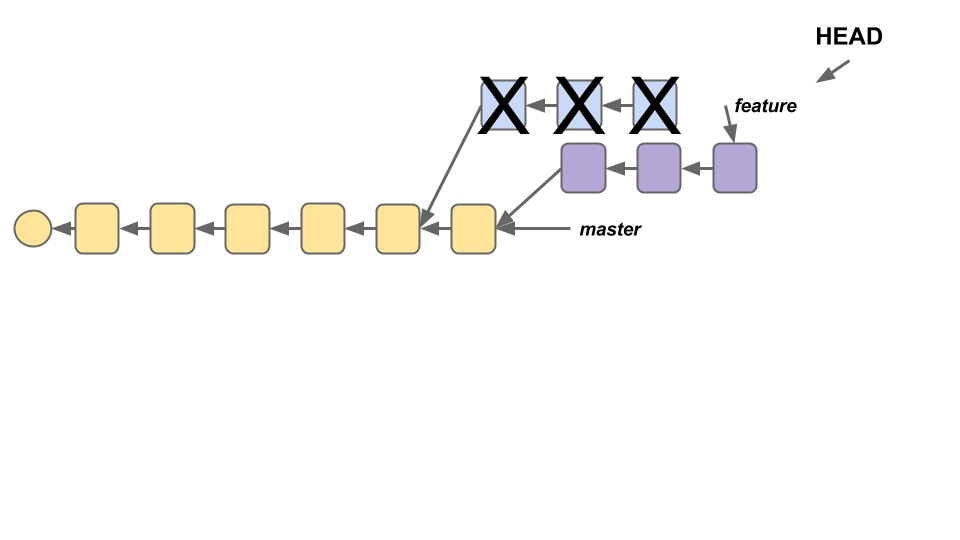

# Team Workflow with Git and GitHub

## Objectives

-   Create branches on a Git repository and make commits on those branches.

-   Combine changes from one branch with another
     using `git merge` or `git rebase`.

-   Combine changes from one branch with another using `git rebase`.

-   Explain what "merge down, rebase up" means

-   In squads, work through our recommended Git workflow
     to build a small project.

## Prerequisites

-   Basic Git workflow
-   Git Branching and Merging

If you're feeling fuzzy on these topics, here's some reading to brush up.

1.  [Atlassian Tutorials: Using Branches](https://www.atlassian.com/git/tutorials/using-branches)

2.  [Atlassian Tutorials: Comparing Workflows](https://www.atlassian.com/git/tutorials/comparing-workflows)

3.  [Atlassian Tutorials: Merging vs Rebasing](https://www.atlassian.com/git/tutorials/merging-vs-rebasing)
      ('Conceptual Overiew' section only)

## Git, Together

Although up until now we've been using Git only to manage our own projects,
 it was actually designed as a tool for _teams_ to use,
 so that they could collaborate more effectively.
Since you're much more likely to be working on a development team
 than working individually, it's important to know
 how to use Git in a team setting.

Specific Git workflows will vary from team to team,
 but most are built around feature branching, the practice of
 using separate Git branches to isolate different features of an application
 while they're under development.
Though this is useful even in the context of working individually,
 since it allows you to easily switch which part of the application
 you're working on, where this approach really shines is in a group setting.
By splitting up features over multiple different branches,
 team members can work in parallel on different parts of an application
 without stepping on each others' toes.

There are three core mechanics within Git that a feature branching strategy
 depends on.
Two of them, branching and merging, you've already seen.
Today, we'll introduce a third: _rebasing_.

### Git Rebase, in Pictures

Suppose that you have two branches in your project, `master` and `feature`,
  and that the `feature` branch is currently checked out.

If you were to check out the master branch and make a new commit,
 the `feature` branch would no longer point to the end of the `master` branch.

How could we update our `feature` branch to incorporate the new change?
One option might be to check out the `feature` branch and merge in `master`.
However, this is a little weird - we're essentially creating a duplicate commit.
What's more, the commit on `master` might not be related to `feature`,
 so it may not make sense for it to be on the `feature` branch.

Rebase essentially allows us to pluck off an entire branch and move it so that
 it points to a different commit.
All we need to do is check out the `feature` branch (`git checkout feature`)
 and run the command `git rebase master`; now, the root of the `feature` branch
 points to the new end of the `master` branch

Now, to be honest, that's not quite what happens - in making the move,
Git actually destroys the old commits and replaces them with new commits
 (with new and different SHAs).

 

This is one of the things that can make `git rebase` dangerous.
If you had other branches that pointed to the old commits on `feature`,
 the rebasing process will completely mess those branches up.
This is why, as a rule, you never rebase code that's already been shared -
 you run the risk of breaking other peoples' code.

However, as long as you're only rebasing your own code on top of things,
 `git rebase` is perfectly safe, and if `master` happens to change a lot,
 it's a great way of making sure that `feature` stays up to date.

Similar to the Feature Branch workflows, but with more rigidly-defined branches.
For example:

-   Historical Branches : `master` stores official releases (see below),
     while `development` serves as a living 'integration branch'
     that ties together all the standalone features.

-   Release Branches : 'release' branches might spring off of `master`,
     pointing to the finished project
     as it existed at a particular moment in time.

-   Feature Branches : pretty much the same as in the prior model.

-   Maintenance/'Hotfix' Branches : branches used
     to quickly patch issues with production code.

##### Advantages of 'Gitflow' Workflow

Highly structured - works well for large projects.

##### Disadvantages of 'Gitflow' Workflow

Sometimes overkill for something small.

### Distributed Workflows

These approaches all use multiple remote repos;
 typically, everyone has their own fork of the 'original' project
 (the version of the repo that's publicly visible
 and is managed by the project maintainer),
 and changes are submitted via pull request.

#### Integration Manager Workflow

One collaborator plays the role of 'Integration Manager'.
This means that they are responsible for managing the official repository
 and either accepting or rejecting pull requests as they come in.

##### Advantages of Integrations Manager Workflow

One person integrates all changes, so there's consistency.

##### Disadvantages of Integrations Manager Workflow

Could get overwhelming for large projects.

#### Dictator/Lieutenants Workflow

This workflow is very similar to the Integration Manager Workflow.
The biggest difference is that
 rather than submitting all pull requests to a single integration manager,
 PRs are funneled through 'Lieutentants', who all report to the 'Dictator'.
Only the Dictator has write access to the official repo.

(This workflow basically has the opposite tradeoff of the previous one).

### Your Turn :: Team Workflow

Though there are a lot of different potential Git workflows for teams,
 for your third project, we'd like you to take the following approach:

-   "Single remote repo"
     (in your case, one for the back-end and one for the front-end),
     managed by the whole team.

-   Feature branching, with all branches merged into a `development` branch.
     The development branch should be fairly clean,
     mostly consisting of merges from feature branches.
     If there are issues with features integrating cleanly,
     you should create a separate branch off of development
     and perform the integration there -
     when finished, you merge these new branches back into development.

> If this were a professional software project,
> you might also use these branches as `release` branches,
> representing complete and fully-functioning
> "release versions" of a piece of software.
> Once a release branch is complete,
> it might get merged with `master`
> and "released" into the world for people to use.

-   When the `development` branch is functional,
     merge it into `master`.
     Barring extraordinary circumstances,
     these merges should be the only commits on the `master` branch.

> For the back-end repo, `master` will used for deployment to Heroku;
> for the front-end repo, you'll be using the `gh-pages` branch for deployment,
> so merge `master` into `gh-pages` when you're ready to deploy.

-   If you use `rebase`, use it only on your personal clone of the repo,
     and only on code that you personally have written.
     _Never, **ever** rebase published code._

To practice this workflow,
 your team will now follow it to create a simple front-end app
 that (in response to a button-click) uses AJAX
 to retrieve (i.e. GET) data from [this API](http://jsonplaceholder.typicode.com/users)
 and renders the data nicely using Handlebars.
Much like the actual front-end repo you make,
 this repo will need a `gh-pages` branch for deployment.

Make commits regularly, in case you need to undo a mistake!

## Further Reading

-   [Git Branches in a Nutshell](http://git-scm.com/book/en/v2/Git-Branching-Branches-in-a-Nutshell)
-   [Distributed Git Workflows](http://git-scm.com/book/en/v2/Distributed-Git-Distributed-Workflows)
