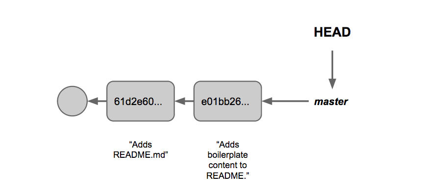
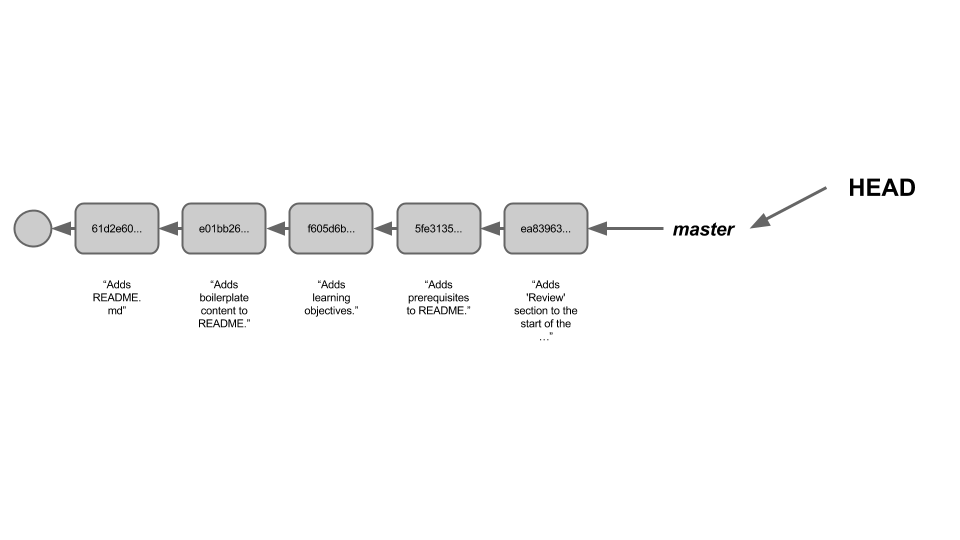
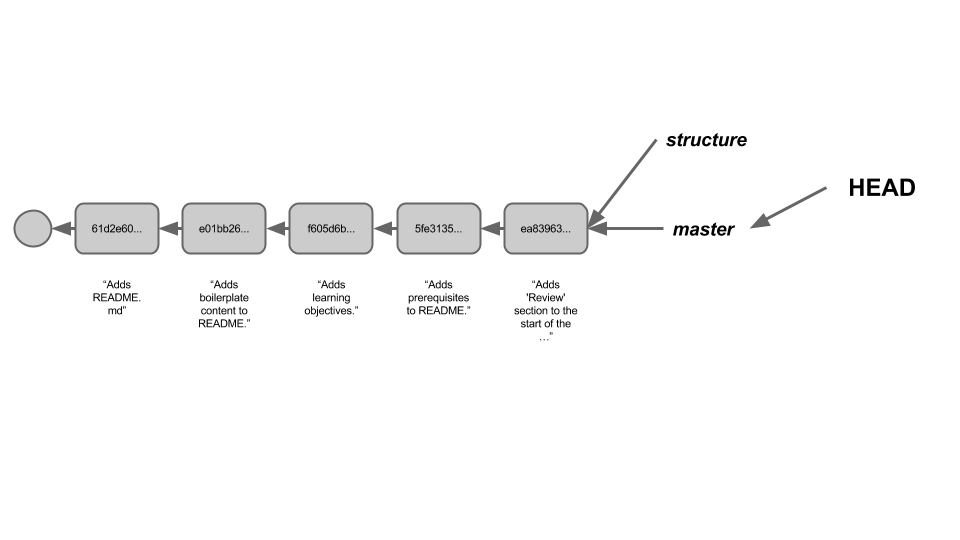
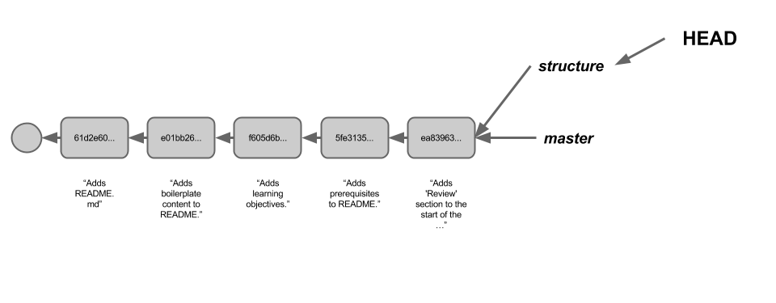
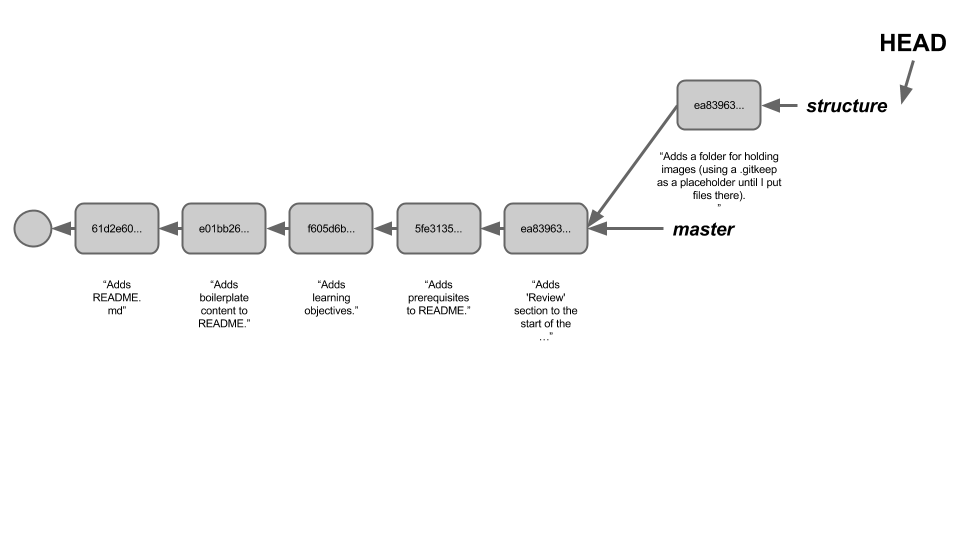

## Objectives
- Create branches on a Git repository and make commits on those branches.
- Combine changes from one branch with another using `git merge`.
- Combine changes from one branch with another using `git rebase`.

## Prerequisites
- Basic Git workflow
- Pre-reading:
  1. https://www.atlassian.com/git/tutorials/using-branches
  2. https://www.atlassian.com/git/tutorials/comparing-workflows
  3. https://www.atlassian.com/git/tutorials/merging-vs-rebasing ('Conceptual Overiew' section)

## REVIEW :: Basic Git Workflow

Although you've all been using Git and Github for over a month, it's still worthwhile to take a look at some of the core ideas of Git.

#### Q: Why Use Version Control?
When you're working on a project, you sometimes want to be able to retrace your steps, or even revert your project to a previous state.  And often (particularly in the workplace) you need a way to effectively collaborate on a single project without stepping on each others' toes. Version control tools address all of these needs.

#### Q: Why Git?
Git, apart from being free and open source, is also in many ways a superior system to many older version control tools (such as Subversion) because it is a "distributed" version control tool. This means that there is no centralized approval structure for making changes to the project; instead, every person who clones the repository has their own complete copy, which they can then edit and change. This makes it much easier to use when working in groups.

>In addition, Git is much better at handling branching and merging, two big topics we'll be covering today.

#### Q: How Does Git Work?
Git works by creating ['snapshots'](https://git-scm.com/book/en/v1/Getting-Started-Git-Basics), which record the current state of a repo. Each snapshot represents the state of the project at some moment in time.

To create a new snapshot, we use `git add` to select (or "stage") a file or files that have changed since our last snapshot, and `git commit` to actually create a new snapshot which includes those changes.

As a rule of thumb, when working full-time on a project you should make at least three commits a day, and probably closer to five or ten. Yes, really!

## Structure of a Git Repo

A Git repository can be imagined as a tree of interconnected nodes, each representing a commit/snapshot. Each of these nodes refers back to one (and only one) previous node, which represents the state of the repository before that commit was made.

Each commit also has a unique name (which allows us to identify it) and a commit message (which tells us what changes the commit makes). `master`, above, is a __branch__ : a reference pointing to some commit in the 'tree' of our repository. New commits can only be made at the end of a branch.

## Branching

In the diagram above, alongside `master` there's another reference called `HEAD`. `HEAD` indicates the point on the repository that we're reading from. When we run `git branch`, new branches get added at wherever `HEAD` points. For instance, if we were to run `git branch structure` on the repo above, here's what would happen.

In addition to specifying where new branches go, if HEAD is pointing at the end of a branch, it also means that new commits will be added to that branch. If we want to start adding commits to our new `structure` branch instead of our `master` branch, we have to move `HEAD`; this is done using the command `git checkout`. In particular, we want to checkout the `structure` branch, so we would run `git checkout structure`.

New commits would then be placed onto the `structure` branch.

### Try It Out

Over the course of the day, we're going to work on a project together - building a simple web page. Pick one person in your group to make a new repo.

In the master branch of your repo, you should start out by
  - Creating a template HTML file (index.html), a blank CSS file (styles/main.css), and a blank JS file (app.js)
  - Making a blank README.md file.
  - Running `npm init`, `npm install bower`, and `bower init` to download and set up NPM and Bower for your project.

Once that's done, make two new branches - one called `ui` and one called `ajax`. When your group is finished with this, tip your laptop screens down.

## Section 3

### Section 3 Activity

## Further Reading

